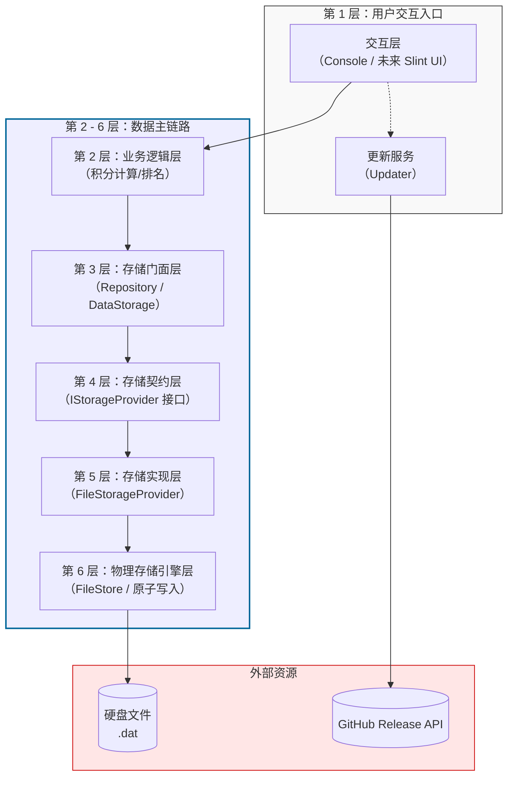

# FastPoints 项目架构文档

> **文档版本**：v2.0（重构版）  
> **最后更新**：2026-08-20  
> **适用代码**：当前仓库最新提交

---

## 一、项目概述与设计哲学

FastPoints 是一款为班级教学场景设计的积分管理系统。**本架构文档描述的是当前代码库的实际结构。**

> *如果你看过项目古早时期的代码，可能会记得一个叫 `data_processing` 的模块（ commit `41834ab` 之前一直在，到`459a112`之前如在），并在对比当前代码时感到困惑。关于它去哪了，以及为什么去，请翻到文末的【附录：架构演进笔记】。如果你没看过那段历史，那就别看那段狗屎历史了。请放心，下面的内容自洽完整，你不需要额外了解它。*

### 三大核心设计原则

1. **分层隔离，自上而下**
   - 上层模块可以调用下层模块，**但绝不允许跨层调用或反向依赖**。调用路径严格为：交互层 → 业务逻辑层 → 存储门面层 → 存储适配层 → 物理存储引擎层。

2. **面向接口编程（依赖倒置）**
   - 业务逻辑层和存储门面层**仅依赖** `IStorageProvider` 抽象接口，不依赖任何具体存储实现。这使得将来替换数据库（如从文件切换至 MySQL）时，只需新增代码，无需修改上层代码。

3. **数据安全优先**
   - 所有磁盘写入采用 **原子替换**（先写 `.tmp`，再 `rename`），配合 **CRC-32 完整性校验**，确保即使在写入过程中断电，原始数据文件也不会损坏。

---

## 二、总体架构视图

下图展示了项目的完整分层结构。**实线箭头**表示主数据流（自上而下），**虚线箭头**表示独立的更新服务支线。



---

## 三、分层职责详解

| 层级 | 模块名称 | 对应文件（模块） | 核心职责 | 当前状态 |
| :--- | :--- | :--- | :--- | :--- |
| **第 1 层** | **用户交互层** | `user_interface.h` / `console.h` | 接收用户输入，展示数据。未来迁移至 Slint GUI 框架。 | **未动工** |
| **支线服务** | **更新服务（Updater）** | `internet_apply.h`（计划重命名为 `update`） | 独立于主数据流，负责检查 GitHub 版本并下载安装包。 | **原型已实现** |
| **第 2 层** | **业务逻辑层** | （`business_logic`） | 实现积分增减、排名计算、规则校验。**绝不直接调用硬盘读写**。 | **待开发** |
| **第 3 层** | **存储门面层** | `data_storage.ixx` | 提供 `StudentRepository` 等工具，支持 Lambda 表达式进行条件筛选。 | **已实现** |
| **第 4 层** | **存储契约层** | `storage_provider.ixx` | 定义纯虚类 `IStorageProvider`（合同），隔离上层与具体存储实现。 | **已实现** |
| **第 5 层** | **存储适配/实现层** | `file_storage_provider.cpp` | **实现合同**。负责业务对象（`StudentData`）与定长二进制结构（`Record`）互转，处理 UTF-8 截断，通过 `path_for` 实现多班级文件隔离。 | **已实现** |
| **第 6 层** | **物理存储引擎层** | `storage_management.ixx` / `.cpp` | **真正的搬砖工**。管理定长记录（161/77 字节）、空闲链表（复用删除空间）、CRC 校验、原子写入（`.tmp` + `rename`）。 | **已实现** |
| | | | | |
| **通用组件** | **实体与异常** | `storage.provider` 中的 DTO / `exceptions.ixx` | 定义纯数据袋子（`StudentData`）和标准异常类型（`file_format_error`），各层均可使用。 | **已实现** |

---

## 四、核心数据流追踪

以“业务逻辑创建一名新学生”为例，展示完整的调用路径和数据形态变化：

```
业务逻辑层（待开发）
    │
    │  调用 storage.students().create(StudentData)
    ▼
存储门面层（StudentRepository）
    │
    │  转发至 IStorageProvider::create_student()
    ▼
存储契约层（IStorageProvider 接口）
    │
    │  实际调用 FileStorageProvider::create_student()
    ▼
存储适配层（FileStorageProvider）
    │  ├─ 调用 students_store_.add()         → 获取空闲柜号（O(1)）
    │  ├─ 调用 to_record(Record, StudentData) → 将 std::string 截断塞入 char[64]
    │  └─ 调用 mark_dirty()                   → 标记数据已变更
    ▼
物理存储引擎层（FileStore<Record>）
    │  ├─ 数据仅存在于内存（pool_ 向量）
    │  └─ 等待显式调用 save() 才落盘
    ▼
原子写入（FileStore::save()）
    │  ├─ Record::put() 将结构体摊平为原始字节流（161 字节）
    │  ├─ 计算 CRC-32
    │  ├─ 写入 students.dat.tmp
    │  └─ rename() 原子替换为 students.dat
```

**数据形态变化链条**：
`StudentData`（含 `std::string`） → `Record`（定长 `char[64]`） → 原始字节流（161 字节） → 硬盘扇区。

---

## 五、关键设计决策与实现亮点

### A. 原子写入与崩溃恢复
- **机制**：所有写入操作先完整写入 `.tmp` 临时文件，确认无误后调用 `std::filesystem::rename()` 原子替换原文件。
- **效果**：任何时刻断电，磁盘上要么是完整的新文件，要么是完整的旧文件，**绝不会出现半写入的损坏状态**。

### B. O(1) 随机访问与空闲链表
- **O(1) 访问**：每条记录固定长度（161 字节），读取第 N 条记录可直接通过 `文件头(32) + N × 161` 计算出偏移量，无需遍历。
- **空闲链表**：被删除的记录通过 `next` 指针串联成空闲链表。新增记录时优先复用这些空闲位置，避免文件无限膨胀。

### C. UTF-8 安全截断
- **问题**：中文在 UTF-8 中占 3~4 字节，若直接按字节数截断可能劈开一个汉字，导致乱码（�）。
- **解决方案**：`copy_utf8_truncated` 函数在截断时**向前回退**，直到落在合法 UTF-8 字符边界（非 `10` 开头的字节）。最终存入的永远是完整字符序列。

### D. 更新服务隔离
- `Updater` 作为独立支线服务，仅处理 GitHub Release 的版本检查与安装包下载。
- **与主数据流完全分离**：未来的远程数据库同步功能将实现在新的 `CloudStorageProvider` 中（继承 `IStorageProvider`），绝不复用 `Updater` 的代码。

### E. 编译期常量（`consteval` + 反射）
- `Record::disk_size()` 和 `RuleRecord::disk_size()` 在编译期求值，分别固定为 `161` 和 `77` 字节。
- 这确保了磁盘布局的确定性，同时让编译器在编译阶段就能校验偏移量计算的正确性。

---

## 六、目录与文件结构映射

| 文件 | 所属层级 | 核心功能 |
| :--- | :--- | :--- |
| `storage_management.ixx` / `.cpp` | 第 6 层 | 物理存储引擎（`FileStore`、`Record`、CRC、原子写入） |
| `file_storage_provider.cpp` | 第 5 层 | 实现 `IStorageProvider`，负责 `StudentData` ↔ `Record` 转换 |
| `storage_provider.ixx` | 第 4 层 | 定义 `IStorageProvider` 接口及 `StudentData`/`RuleData` DTO |
| `data_storage.ixx` | 第 3 层 | 提供 `StudentRepository`、`RuleRepository`、`GiftRepository` 门面 |
| `internet_apply.h`（待重命名） | 支线服务 | 更新服务（`fetch_git_release_json` / `download`） |
| `entity.h` | 通用层 | 旧版实体定义（逐步向 `StudentData` 迁移） |
| `exceptions.ixx` | 通用层 | 自定义异常类型（`file_format_error`、`internet_error`） |

---

## 七、开发现状与未来路线图

### 已完成
- [x] 物理存储引擎层（`FileStore`，含原子写入、空闲链表、CRC 校验）
- [x] 存储适配层（`FileStorageProvider`，含 UTF-8 截断、多班级文件隔离）
- [x] 存储契约层（`IStorageProvider` 接口）
- [x] 存储门面层（`Repository`，支持 Lambda 条件筛选）
- [x] 更新服务原型（`Updater`，GitHub Release 拉取）

### 待开发
- [ ] **业务逻辑层**（`business_logic`）：积分计算、排名更新、规则校验。
- [ ] **用户交互层**：控制台界面完善，或直接对接 Slint UI 框架。

### 未来规划
- [ ] 将控制台交互迁移至 Slint GUI，提升用户体验。
- [ ] 将 `FileStorageProvider` 替换/扩展为 `CloudStorageProvider`，实现远程数据同步（体现了 `IStorageProvider` 接口的解耦威力）。

---

## 八、附录

感谢chenjintang-shrimp设计并一手实现的工业级存储方案。

<details>
<summary><b>📜 考古笔记：如果你好奇当年那个“数据处理层”哪去了……</b></summary>

*如果你翻到古早的 commit，你可能会看到一个叫 `data_processing` 的模块（ commit `41834ab` 之前一直在，到`459a112`之前如在）。别找了，它被拆了。*

**为什么拆？**
旧版 `data_processing` 试图同时承担两项职责：
1. **格式转换**（Entity ↔ Binary）
2. **查询筛选**（find / all 逻辑）

这导致它既依赖上层业务逻辑的调用约定，又依赖下层存储引擎的二进制布局——任何一方的变更都会波及它。

**怎么拆的？**
- **转换职责**被**下放**至第 5 层（`FileStorageProvider`），因为转换行为与存储格式强相关，理应紧贴存储。
- **查询筛选职责**被**上提**至第 3 层（`Repository`），因为筛选条件与业务逻辑强相关，理应靠近上层。

**拆完后的效果**：
- 底层（`FileStore`）不知道自己在存学生还是规则，只知道存字节。
- 上层（业务逻辑）不知道数据存在文件还是数据库，只调用 `storage.students().find(...)`。

*如果你能读懂本文第 2 节的 Mermaid 图，上面这些历史细节完全不重要。这段笔记纯属为好奇者准备。😉*

</details>

---

*本文档在 AI 辅助下编写，经人工审查与修改，确保内容准确反映项目实际架构。*
